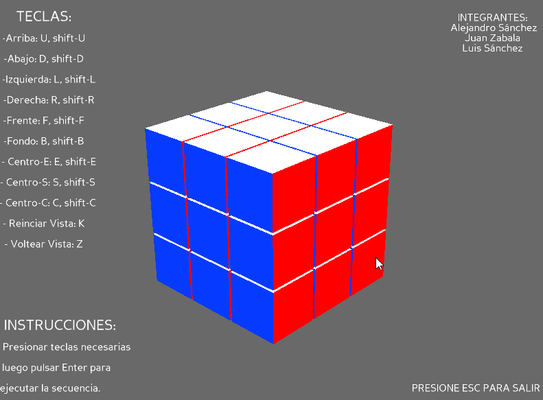

# RubiksCube-Panda3D

## Installation
**You need to have installed Python 3.7 and Panda3D**
1. Install Panda3D
```
pip install panda3d
```
2. Clone this repo to your own computer

3. Run start.bat or open cmd and write the following:
```
py cubo.py
```
